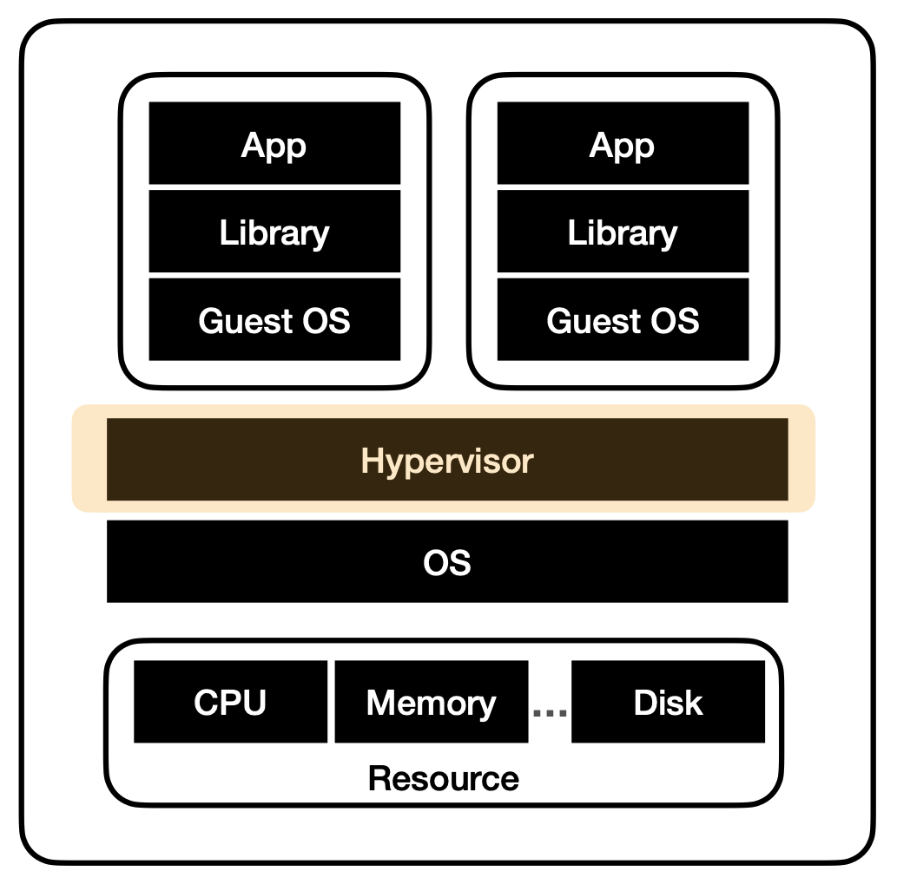
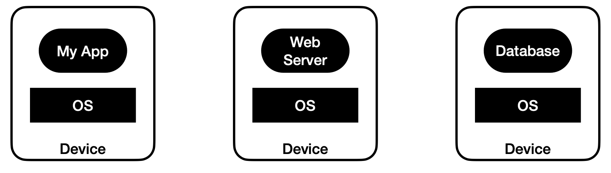

# Docker란 무엇인가

[도커 공식 홈페이지 훓어보기](https://docs.docker.com/get-started/overview/)

- Open Platform.
- 어플리케이션을 인프라에서 분리|격리해준다.
- 신속하다.
- 인프라를 어플리케이션을 관리하는 것 처럼 관리할 수 있다.
- 코드 배포에 용이하다.
- **컨테이너** 기반 **가상화** 도구.
- 어플리케이션을 **컨테이너**라는 단위로 격리하여 실행하고 배포하는 기술.

## Container란 무엇인가

- 컨테이너는 **가상화 기술** 중 하나.
- 호스트 운영체제 위에 여러 개의 격리된 환경을 생성.
- 각각의 컨테이너 안에서 어플리케이션을 실행.

## 가상화(Virtualization) 기술이란 무엇인가

**하나의 물리적인 컴퓨터 자원**(CPU, 메모리, 저장장치)을  
**가상적으로 분할**하여 여러 개의 **가상 컴퓨터 환경**을 만들어 내는 기술  
이를 통해 물리적인 컴퓨터 자원을 더욱 **효율적**으로 사용할 수 있음.  
서버나 어플리케이션 등의 운영에 있어 **유연성**과 **안정성**을 제공함.

### 고성능 서버를 조금 더 안정적이고 효율적으로 사용하는 방법?

### 하이퍼바이져(Hypervisor)란?

- 가상머신(Virtual Machine, VM)을 생성하고 구동하는 소프트웨어.
- OS에 자원을 할당 및 조율.
- OS들의 요청을 번역하여 H/W에 전달.

### Container 구조

  

## 활용 예제

  

## Virtual Machine VS Container

## 컨테이너 기반의 특징

- 리눅스 커널의 기능을 사용하여 만들어짐.
  - chroot : 파일 시스템을 격리.
  - namespace : 프로세스 격리.
  - cgroup : 하드웨어 자원 격리.
- 프로세스 단위의 격리 환경.

## 도커란 +

- **컨테이너** 기반 **가상화** 도구.
  - 리눅스 컨테이너 기술인 LXC(Linux Containers) 기반.
- 다양한 운영체제에서 사용할 수 있으며, 컨테이너화된 어플리케이션을 손쉽게 빌드, 배포, 관리할 수 있는 다양한 기능 제공.
- 위 기능들을 통해 어플리케이션을 빠르게 개발하고, 효율적으로 배포, 관리할 수 있음.
