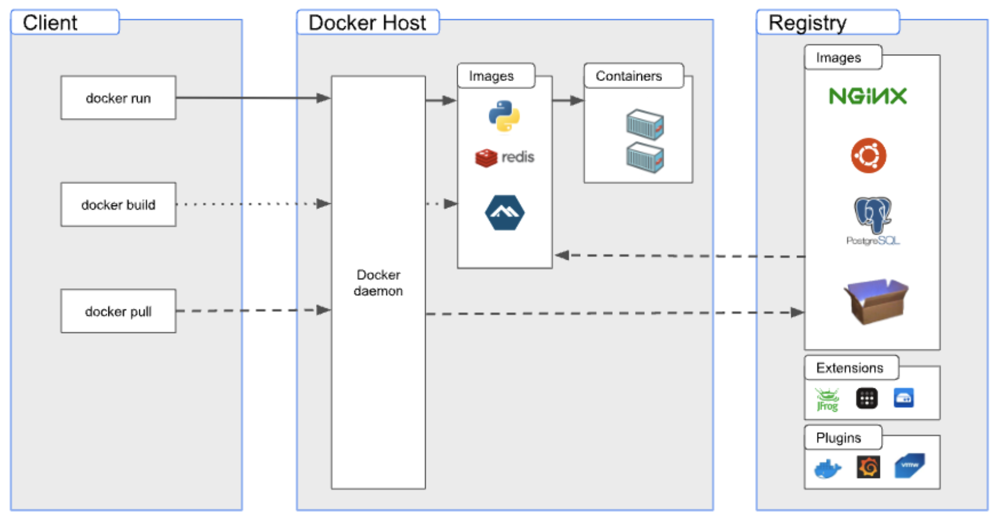
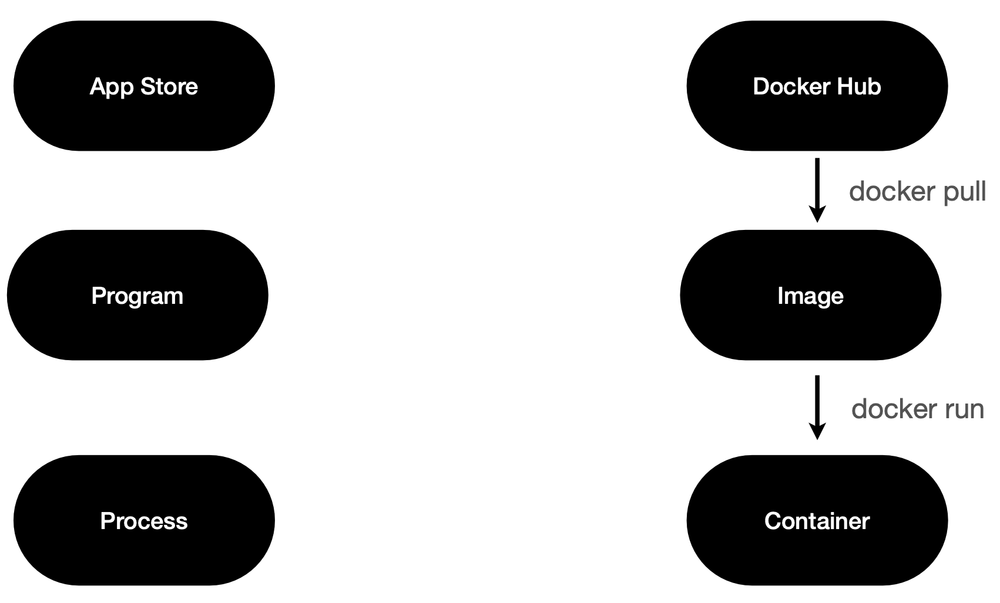

# Docker Architecture

## 도커 데몬 (Docker daemon; dockerd)

- 도커 엔진의 핵심 구성 요소.
- 도커 호스트에서 컨테이너를 관리하고 실행하는 역할.
- 컨테이너를 생성, 시작, 중지, 삭제하는 등의 작업을 수행.
- 컨테이너 이미지를 관리.
- 외부에서 이미지를 다운로드, 빌드.

## 도커 클라이언트 (Docker Client)

- Docker와 상호 작용.
- docker 명령어를 사용하면 Docker Daemon으로 보내어 실행.

## 도커 오브젝트 (Docker Object)

- 도커 이미지 (Docker Image)
  - 도커 컨테이너를 만들기 위한 읽기 전용 템플릿.
- 도커 컨테이너 (Docker Container)
  - 한 도커 이미지의 실행 가능한 인스턴스.
  - 어플리케이션을 실행하기 위한 모든 파일과 설정 정보를 포함하는 패키지.
- 도커 레지스트리 (Docker Registries)
  - 도커 이미지를 관리하고 저장하는 곳.
  - Docker Hub : 디폴트 레지스트리, 누구나 접근 가능한 공개형 저장소.

