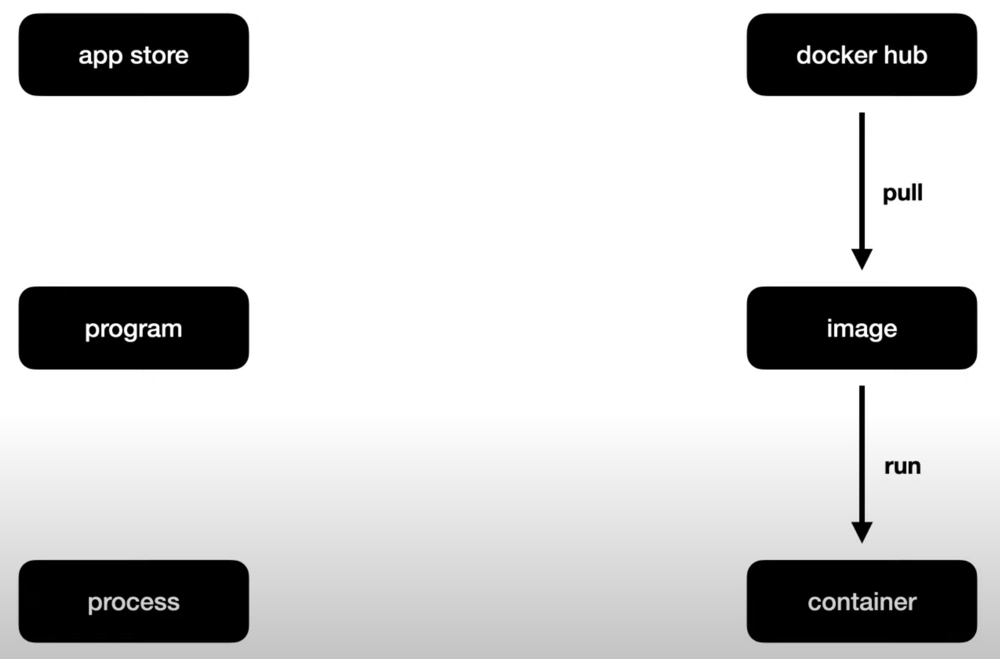

# 도커 이미지 pull

## pull과 run

- app store에서 다운로드 받은 program을 실행하면 program의 process가 동작함.
- docker hub에서 다운로드 받은 image를 실행하면 container가 동작함.
- pull : image를 다운로드 받는 행위.
- run : 다운받은 image를 실행하는 행위.



## docker pull

[공식문서](https://docs.docker.com/engine/reference/commandline/pull/)

registry로 부터 image를 다운 받는 명령어.

- 사용법

```shell
  docker pull [OPTIONS] NAME[:TAG|@DIGEST]
```

- 예제

```shell
  docker pull httpd
```

## docker images

[공식문서](https://docs.docker.com/engine/reference/commandline../images/)

host 컴퓨터에서 갖고 있는 docker image들을 확인하는 명령어.

- 사용법

```shell
  docker images [OPTIONS] [REPOSITORY[:TAG]]
```

- 예제

```shell
  docker images
```
