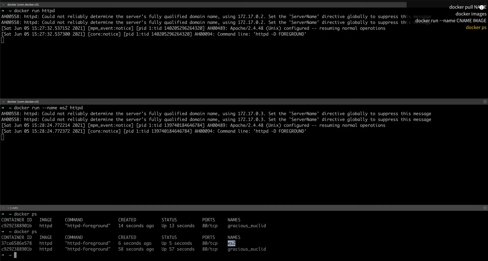
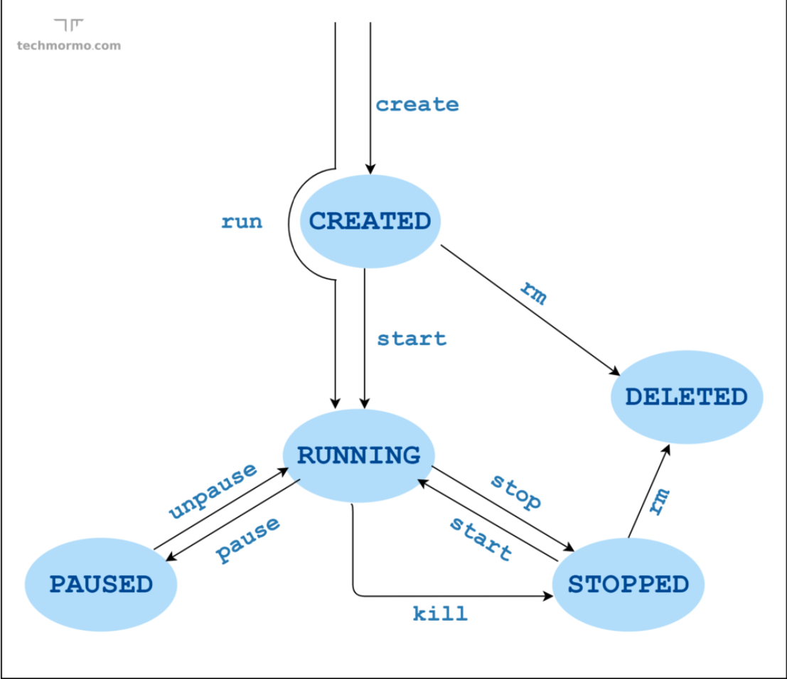

# Docker 실행하기

## docker run

[공식문서](https://docs.docker.com/engine/reference/commandline/run/)

이미지에서 새로운 컨테이너를 생성 후 실행.

- 사용법

```shell
  docker run [OPTIONS] IMAGE_NAME [COMMAND] [ARG...]
```

- 예제

```shell
  docker run httpd
  # 컨테이너에 이름 부여
  docker run --name secondContainer httpd
```

### docker start

[공식문서](https://docs.docker.com/engine/reference/commandline/start/)

1개 이상의 컨테이너 실행.

- 사용법

```shell
  docker start [OPTIONS] CONTAINER [CONTAINER...]
```

- 예제

```shell
  docker start c8274d6a6273
```

### docker stop

[공식문서](https://docs.docker.com/engine/reference/commandline/stop/)

실행중인 1개 이상의 컨테이너 종료

- 사용법

```shell
  docker stop [OPTIONS] CONTAINER [CONTAINER...]
```

- 예제

```shell
  docker stop 9b0f49de746c
  docker stop -a
```

## docker ps

[공식문서](https://docs.docker.com/engine/reference/commandline/ps/)

컨테이너를 확인하는 명령어

```shell
  docker ps
  # 중지된 컨테이너는 -a 옵션을 줘야 볼 수 있다
  docker ps -a
```

## 실행해보기



### docker logs

[공식문서](https://docs.docker.com/engine/reference/commandline/logs/)

실행중인 컨테이너의 log를 확인

- 사용법

```shell
  docker logs [OPTIONS] CONTAINER
```

- 예제

```shell
  docker logs second
  # 로그를 계속해서 보고싶다면 -f 옵션을 준다.
  docker logs second -f
```

### 컨테이너 삭제

[공식문서](https://docs.docker.com/engine/reference/commandline/rm/)

- 사용법

```shell
  docker rm [OPTIONS] CONTAINER [CONTAINER...]
```

- 예제

```shell
  docker rm 6026ab9b44cc
  # 실행중인 컨테이너는 -f 옵션을 넣어야 삭제할 수 있다.
  docker rm second -f
```

### 도커 이미지 삭제

[공식문서](https://docs.docker.com/engine/reference/commandline/rmi/)

- 사용법

```shell
  docker rmi [OPTIONS] IMAGE [IMAGE...]
```

- 예제

```shell
  docker rmi 6026ab9b44cc
```

## The Container Lifecycle


