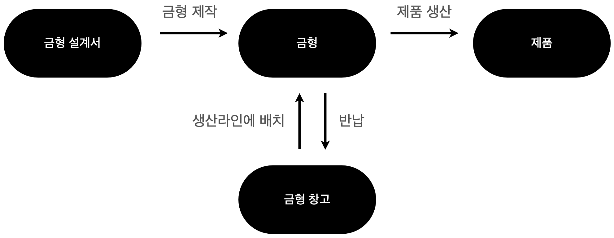

# Dockerfile

- Dockerfile
- Docker image
- Docker hub

## Dockerfile 이란

- 도커 컨테이너를 빌드하고 설정하는 데 사용되는 텍스트 파일.
- 도커 이미지를 어떻게 구성할지를 정의하는 파일.
- 도커 이미지를 만들기 위한 명령어와 설정 정보를 담고 있음.
  - 베이스 이미지
  - 빌드시 실행할 명령어
  - 복사할 파일
  - 환경변수
- 이미지를 만들어가는 느낌으로 볼 수 있음.

  


## Dockerfile 활용

1. Dockerfile 예제

```Dockerfile
  FROM httpd:latest
  COPY  index.html /usr/local/apache2/htdocs/index.html
  EXPOSE 80
```

2. 이미지 만들기

```shell
  docker build -t my-httpd .
```

3. 도커파일로 생성된 이미지로 컨테이너 실행하기

```shell
  docker run -d -p 8888:80 my-httpd
```

## 도커 이미지 빌드하기

[Dockerfile syntax](https://docs.docker.com/engine/reference/builder/)

- [공식 문서](https://docs.docker.com/build/guide/intro/)
- FROM : 베이스 이미지 선정
- WORKDIR : work directory 선정
- COPY : 복사할 파일 선정 (예 : 작업한 서비스 파일들)
- RUN : (이미지 빌드 시) 실행할 명령어
- CMD : (컨테이너 생성시) 실행할 명령어
- ENTRYPOINT : (컨테이너가 생성 후 최초로) 실행할 명령어 (에 : 서버 실행)

### FROM

- [공식문서](https://docs.docker.com/engine/reference/builder/#from)
- 베이스 이미지 선정.
- 반드시 있어야 하는 명령어.
- 여러겹의 이미지를 쌓아 가는데, 그 층 중 가장 기본이 되는 이미지.

### WORKDIR

- [공식문서](https://docs.docker.com/engine/reference/builder/#workdir)
- 작업 경로 선정.
- 도커파일 뒤에 오는 모든 지시자(RUN, CMD, COPY, ADD 등)에 대한 작업 디렉토리 설정.
- Linux의 cd와 비슷한 역할.

### COPY

- [공식문서](https://docs.docker.com/engine/reference/builder/#copy)
- 복사할 파일 선정 (예 : 작업한 서비스 파일 들, index.html)
- 현재 로컬 컴퓨터(호스트)에 있는 파일을 도커 컨테이너 안으로 복사하는 기능.

### RUN

- [공식문서](https://docs.docker.com/engine/reference/builder/#run)
- **이미지 빌드 시** 실행할 명령어.

### CMD

- [공식문서](https://docs.docker.com/engine/reference/builder/#cmd)
- **컨테이너 생성 시** 실행할 명령어.
- 이미지로부터 컨테이너를 생성하여 최초로 실행할 때 수행.

### ENTRYPOINT

- [공식문서](https://docs.docker.com/engine/reference/builder/#entrypoint)
- **컨테이너가 생성되고 최초로** 실행할 명령어.

### Layers in image

[공식문서](https://docs.docker.com/build/guide/layers/)

- Dockerfile을 빌드하여 Docker 이미지를 생성하면 Dockerfile의 명령별로 이미지를 생성함.
- 작성된 여러 개의 이미지는 레이어 구조로 되어있음.


```Dockerfile
  # STEP 1 : Ubuntu 베이스 이미지
  FROM ubuntu:latest

  # STEP 2 : Nginx 설치
  RUN apt-get update && apt-get install -y -q nginx

  # STEP 3 : 파일 복사
  COPY index.html /usr/share/nginx/html

  # STEP 4 : Nginx 시작
  CMD ["nginx", "-g", "daemon off;"]
```


