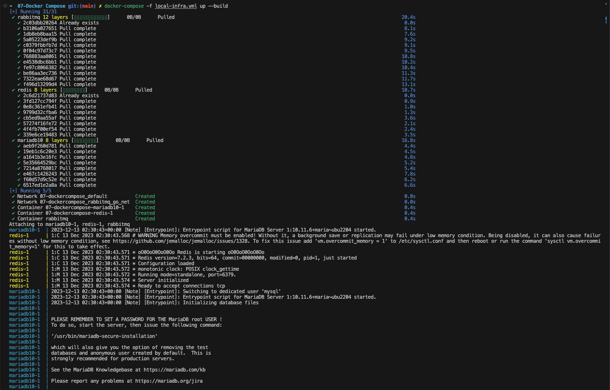
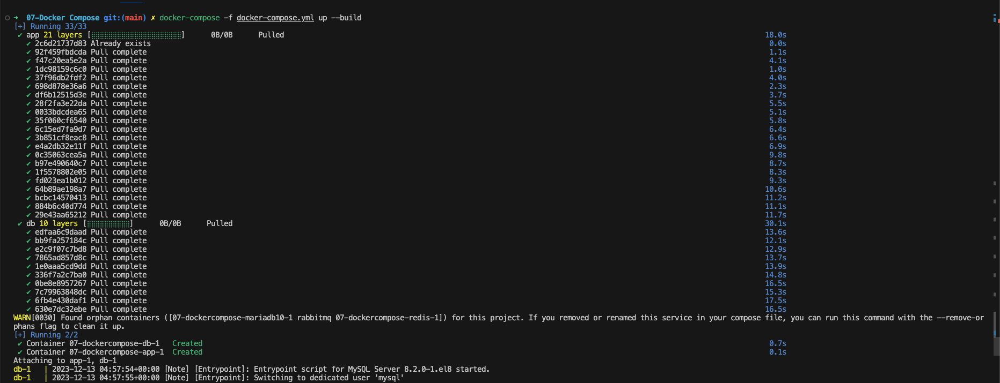
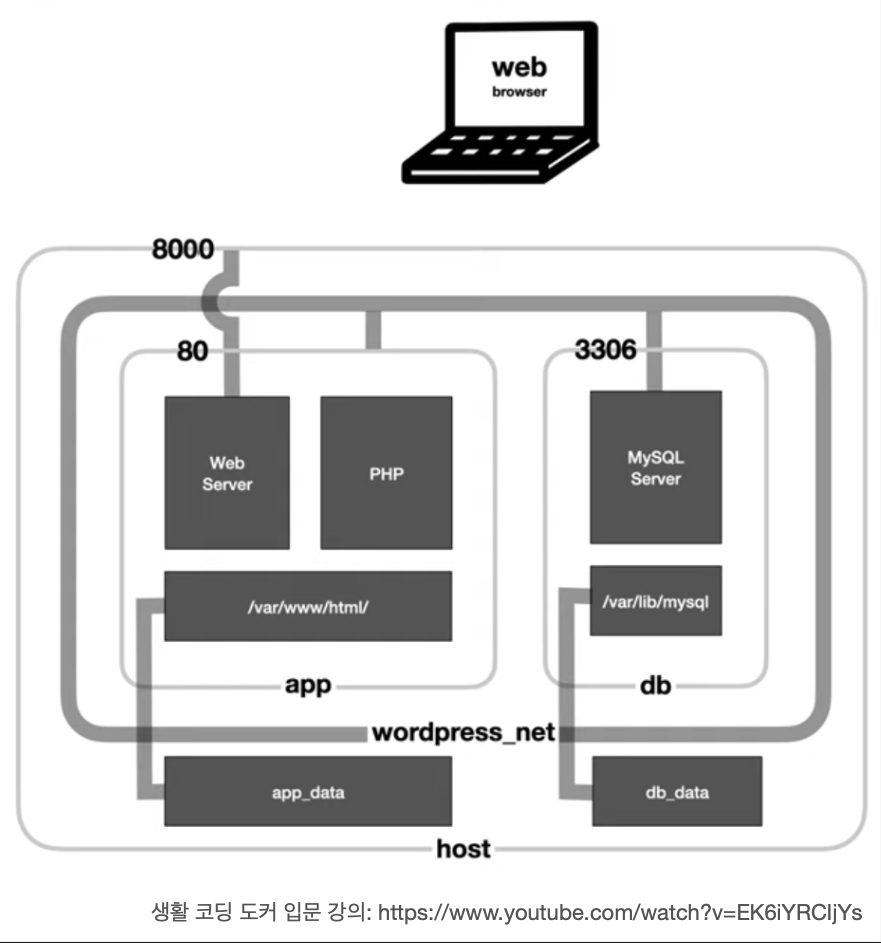

# 도커 컴포즈란?

[공식문서](https://docs.docker.com/get-started/08_using_compose/)

- 도커 컨테이너를 일괄적으로 정의하고 제어하는 도구.
- 설정 파일을 도커 CLI로 번역하는 역할.
- yml 설정 파일로 여러개의 컨테이너를 관리할 수 있음.
- 예) docker-compose.yml

  ```shell
    version: "3.0"

    services:
      db:
        image: mysql:latest
        volumes:
          - ./db_data:/var/lib/mysql
        restart: always
        environment:
          MYSQL_ROOT_PASSWORD: root_pass
          MYSQL_DATABASE: wordpress
          MYSQL_USER: docker_pro
          MYSQL_PASSWORD: docker_pro_pass

      app:
        depends_on:
          - db
        image: wordpress:latest
        volumes:
          - ./app_data:/var/www/html
        ports:
          - "8000:80"
        restart: always
        environment:
          WORDPRESS_DB_HOST: db:3306
          WORDPRESS_DB_NAME: wordpress
          WORDPRESS_DB_USER: docker_pro
          WORDPRESS_DB_PASSWORD: docker_pro_pass
  ```

---

## docker compose 없이 여러개의 컨테이너 관리하기

1. 도커 네트워크 생성

```shell
  docker network create example_docker_network
```

2. mysql db container 생성

```shell
  docker \
  run \
    --name "db" \
    -v "$(pwd)/db_data:/var/lib/mysql" \
    -e "MYSQL_DATABASE=docker_compose_example" \
    -e "MYSQL_ROOT_PASSWORD=root_pass" \
    -e "MYSQL_USER=docker_pro" \
    -e "MYSQL_PASSWORD=docker_pro_password" \
    --network example_docker_network \
  mysql:latest
```

3. wordpress container 생성

```shell
    docker \
    run \
      --name app \
      -v "$(pwd)/app_data:/var/www/html" \
      -e "WORDPRESS_DB_HOST=db" \
      -e "WORDPRESS_DB_NAME=docker_compose_example" \
      -e "WORDPRESS_DB_USER=docker_pro" \
      -e "WORDPRESS_DB_PASSWORD=docker_pro_password" \
      -p 8000:80 \
      --network example_docker_network \
    wordpress:latest
```

---

## docker compose를 이용하여 여러개의 컨테이너 관리하기

- docker-compose.yml

```shell
    version: "3.0"

    services:
      db:
        image: mysql:latest
        volumes:
          - ./db_data:/var/lib/mysql
        restart: always
        environment:
          MYSQL_ROOT_PASSWORD: root_pass
          MYSQL_DATABASE: wordpress
          MYSQL_USER: docker_pro
          MYSQL_PASSWORD: docker_pro_pass

      app:
        depends_on:
          - db
        image: wordpress:latest
        volumes:
          - ./app_data:/var/www/html
        ports:
          - "8000:80"
        restart: always
        environment:
          WORDPRESS_DB_HOST: db:3306
          WORDPRESS_DB_NAME: wordpress
          WORDPRESS_DB_USER: docker_pro
          WORDPRESS_DB_PASSWORD: docker_pro_pass
```

- local-infra.yml

  ```shell
    version: '3.0'

    services:
      mariadb10:
        image: mariadb:10
        ports:
        - "3310:3306/tcp"
        environment:
          - MYSQL_ROOT_PASSWORD=my_db_passward
          - MYSQL_USER=docker_pro
          - MYSQL_PASSWORD=docker_pro_pass
          - MYSQL_DATABASE=docker_pro
      redis:
        image: redis
        command: redis-server --port 6379
        restart: always
        ports:
          - 6379:6379
      rabbitmq:
        image: rabbitmq:3-management-alpine
        container_name: 'rabbitmq'
        ports:
            - 5672:5672
            - 15672:15672
        volumes:
            - ~/.docker-conf/rabbitmq/data/:/var/lib/rabbitmq/
            - ~/.docker-conf/rabbitmq/log/:/var/log/rabbitmq
        networks:
            - rabbitmq_go_net

    networks:
      rabbitmq_go_net:
        driver: bridge
  ```

  

- docker compose 실행

```shell
  docker compose -f docker-compose.yml up --build
```

## 도커 컴포즈 명령어

[공식문서](https://docs.docker.com/compose/reference/)

- docker-compose -f local-infra.yml up -d
  - up : 도커 컴포즈 파일로 컨테이너 생성.
  - -f : 도커 컴포즈 파일 지정.
  - -d : 백그라운드에서 실행.

## 도커 컴포즈 파일의 구성

[공식문서](https://docs.docker.com/compose/compose-file/03-compose-file/)

- [version](https://docs.docker.com/compose/compose-file/compose-versioning/)
  - compose 파일의 버전 명시.
  - versioin 2 혹은 3 선택.
- services
  - 실행하려는 컨테이너들을 정의하는 역할.
  - 이름, 이미지, 포트 매핑, 환경 변수, 볼륨 등을 포함.
  - 해당 정보를 가지고 컨테이너를 생성하고 관리.
- network
  - 사용할 네트워크 정의.
- volume
  - 컨테이너 데이터 관리.
  - 컨테이너에 볼륨을 마운트 할 때 지정.
    - 호스트 측에서 마운트할 경로를 지정하려면 아래 형식으로 지정.  
      `{호스트의 디렉토리 경로}:{컨테이너의 디렉토리}`
      ```shell
        volumes:
          - /var/lib/mysql
          - cache/:/tmp/cache
      ```
    - 읽기 전용 지정.
      ```shell
        volumes:
          - ~/configs:/etc/configs/:ro
      ```
    - 다른 컨테이너로부터 볼륨을 마운트 할 때 volumes_from 키워드 사용.  
      log 라는 이름의 컨테이너로 마운트 할 때
      ```shell
        volumes_from:
          - log
      ```
- config

- secret

### services

- image : 컨테이너를 생성할 때 쓰일 이미지 지정.
- build : 정의된 도커파일에서 이미지를 빌드해 서비스의 컨테이너를 생성하도록 설정.
- environment : 환경 변수 설정, docker run 명령어의 --env, -e 옵현과 동일.
- command : 컨테이너가 실행될 때 수행할 명령어, docker run 명령어의 마지막에 붙는 커맨드와 동일.
- depends_on : 컨테이너 간의 의존성 주입, 명시된 컨테이너가 먼저 생성되고 실행.
- ports : 개발할 포트 지정, docker run 명령어의 -p와 동일.
- expose : 링크로 연계된 컨테이너에게만 공개할 포트 설정.
- volumes : 컨테이너에 볼륨을 마운트 함.
- restart : 컨테이너가 종료될 대 재시작 정책.
  - no : 재시작 되지 않음.
  - always : 외부에 영향에 의해 종료 되었을 때 항상 재시작(수동으로 끄기 전까지).
  - on-failure : 오류가 있을 시 재시작.

### docker-compose vs docker compose?

docker-compose 명령어가 docker compose로 흡수되었음.  
이전 버전의 Docker에서는 docker-compose 명령어가 별도로 설치되어야 했지만,  
Docker 1.13 이후로는 docker-compose 명령어가 Docker CLI에 통합됨.

## 도커 CLI로 여러개 컨테이너 관리하기

**docker-compose.yml**

  

